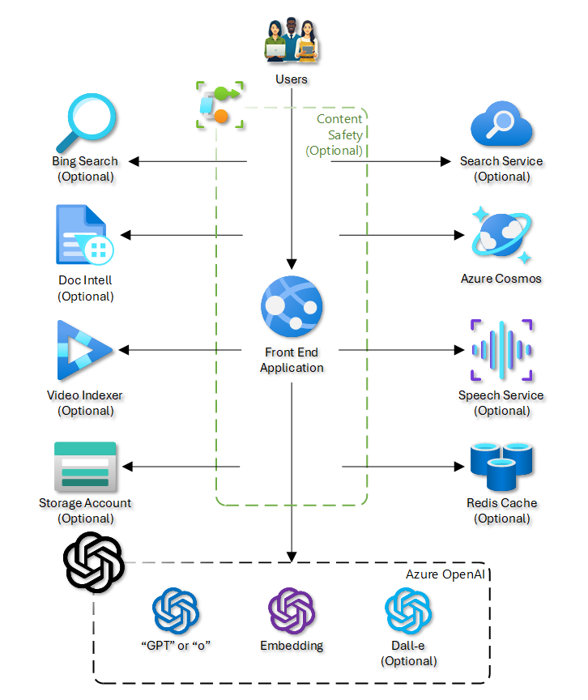
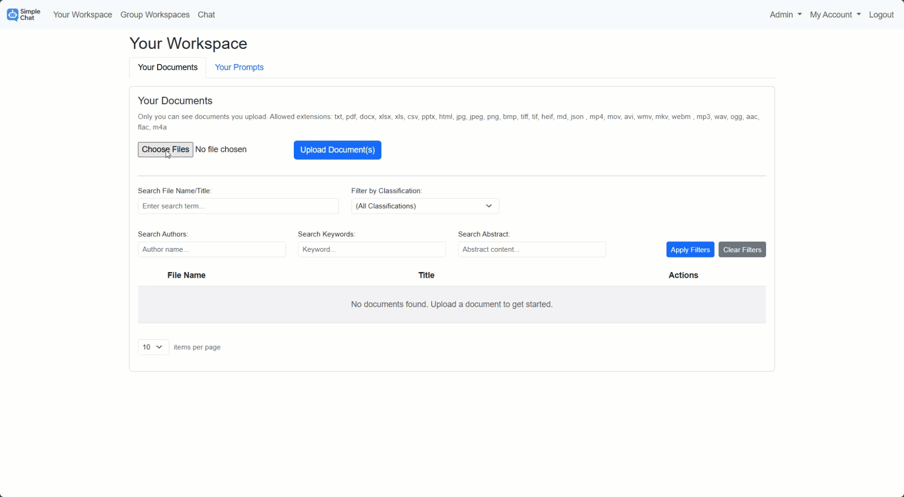
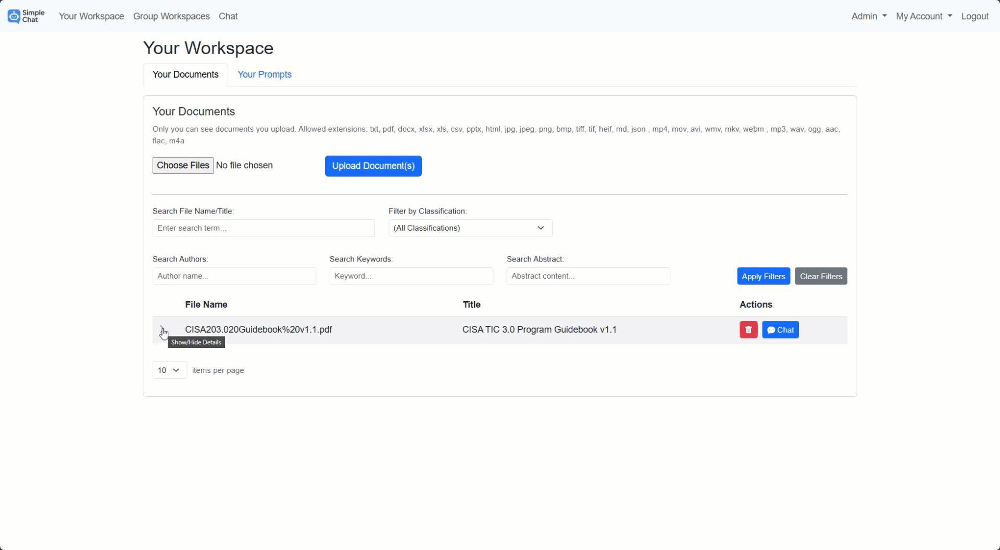

# Overview

The **Simple Chat Application** is a comprehensive, web-based platform designed to facilitate secure and context-aware interactions with generative AI models, specifically leveraging **Azure OpenAI**. Its central feature is **Retrieval-Augmented Generation (RAG)**, which significantly enhances AI interactions by allowing users to ground conversations in their own data. Users can upload personal ("Your Workspace") or shared group ("Group Workspaces") documents, which are processed using **Azure AI Document Intelligence**, chunked intelligently based on content type, vectorized via **Azure OpenAI Embeddings**, and indexed into **Azure AI Search** for efficient hybrid retrieval (semantic + keyword).

Built with modularity in mind, the application offers a suite of powerful **optional features** that can be enabled via administrative settings. These include integrating **Azure AI Content Safety** for governance, providing **Image Generation** capabilities (DALL-E), processing **Video** (via Azure Video Indexer) and **Audio** (via Azure Speech Service) files for RAG, implementing **Document Classification** schemes, collecting **User Feedback**, enabling **Conversation Archiving** for compliance, extracting **AI-driven Metadata**, and offering **Enhanced Citations** linked directly to source documents stored in Azure Storage.

The application utilizes **Azure Cosmos DB** for storing conversations, metadata, and settings, and is secured using **Azure Active Directory (Entra ID)** for authentication and fine-grained Role-Based Access Control (RBAC) via App Roles. Designed for enterprise use, it runs reliably on **Azure App Service** and supports deployment in both **Azure Commercial** and **Azure Government** cloud environments, offering a versatile tool for knowledge discovery, content generation, and collaborative AI-powered tasks within a secure, customizable, and Azure-native framework.

## Table of Contents

- [Features](./docs/features.md)
  - [Application Features](#features)
  - [Architecture Diagram](#architecture-diagram)
  - [Optional Features](./docs/features.md#optional-features) 
- [Release Notes](./RELEASE_NOTES.md)
- [Roadmap (as of 8/20/25)](https://github.com/microsoft/simplechat/discussions/133)
- [Application Workflow](./docs/application_workflows.md)
  - [Content Safety](./docs/application_workflows.md#content-safety---workflow)
  - [Add your data (RAG Ingestion)](./docs/application_workflows.md#add-your-data-rag-ingestion)
- [Demos](#demos)
  - [Upload document and review metadata](#upload-document-and-review-metadata)
  - [Classify document and chat with content](#classify-document-and-chat-with-content)
- [Setup Instructions](./docs/setup_instructions.md)
  - [Azure CLI with Powershell](./docs/setup_instructions.md#azure-cli-with-powershell)
  - [Bicep](./docs/setup_instructions.md#bicep)
  - [Terraform](./docs/setup_instructions.md#hashicorp-terraform)
  - [Special Cases](./docs/setup_instructions_special.md)
    - [Azure Government Configuration](./docs/setup_instructions_special.md#azure-government-configuration)
    - [How to use Managed Identity](./docs/setup_instructions_special.md#how-to-use-managed-identity)
    - [Enterprise Networking](./docs/setup_instructions_special.md#enterprise-networking)
  
- [Admin Configuration](./docs/admin_configuration.md)
- [Application Scaling](./docs/application_scaling.md)
  - [Azure App Service](./docs/application_scaling.md#azure-app-service)
  - [Azure Cosmos DB](./docs/application_scaling.md#azure-cosmos-db)
  - [Azure AI Search](./docs/application_scaling.md#azure-ai-search)
  - [Azure AI / Cognitive Services](./docs/application_scaling.md#azure-ai--cognitive-services-openai-document-intelligence-etc)
- [FAQs](./docs/faqs.md)
- [External Apps Overview](./docs/external_apps_overview.md)
  - [Bulk uploader utility](./docs/external_apps_overview.md#bulk-uploader-utility)
  - [Database seeder utility](./docs/external_apps_overview.md#database-seeder-utility)

## Features

- **Chat with AI**: Interact with an AI model based on Azure OpenAI’s GPT models.

- **RAG with Hybrid Search**: Upload documents and perform hybrid searches (vector + keyword), retrieving relevant information from your files to augment AI responses.

- **Document Management**: Upload, store, and manage multiple versions of documents—personal ("Your Workspace") or group-level ("Group Workspaces").

- **Group Management**: Create and join groups to share access to group-specific documents, enabling collaboration with Role-Based Access Control (RBAC).

- **Ephemeral (Single-Convo) Documents**: Upload temporary documents available only during the current chat session, without persistent storage in Azure AI Search.

- **Conversation Archiving (Optional)**: Retain copies of user conversations—even after deletion from the UI—in a dedicated Cosmos DB container for audit, compliance, or legal requirements.

- **Content Safety (Optional)**: Integrate Azure AI Content Safety to review every user message *before* it reaches AI models, search indexes, or image generation services. Enforce custom filters and compliance policies, with an optional `SafetyAdmin` role for viewing violations.

- **Feedback System (Optional)**: Allow users to rate AI responses (thumbs up/down) and provide contextual comments on negative feedback. Includes user and admin dashboards, governed by an optional `FeedbackAdmin` role.

- **Bing Web Search (Optional)**: Augment AI responses with live Bing search results, providing up-to-date information. Configurable via Admin Settings.

- **Image Generation (Optional)**: Enable on-demand image creation using Azure OpenAI's DALL-E models, controlled via Admin Settings.

- **Video Extraction (Optional)**: Utilize Azure Video Indexer to transcribe speech and perform Optical Character Recognition (OCR) on video frames. Segments are timestamp-chunked for precise retrieval and enhanced citations linking back to the video timecode.

- **Audio Extraction (Optional)**: Leverage Azure Speech Service to transcribe audio files into timestamped text chunks, making audio content searchable and enabling enhanced citations linked to audio timecodes.

- **Document Classification (Optional)**: Admins define custom classification types and associated colors. Users tag uploaded documents with these labels, which flow through to AI conversations, providing lineage and insight into data sensitivity or type.

- **Enhanced Citation (Optional)**: Store processed, chunked files in Azure Storage (organized into user- and document-scoped folders). Display interactive citations in the UI—showing page numbers or timestamps—that link directly to the source document preview.

- **Metadata Extraction (Optional)**: Apply an AI model (configurable GPT model via Admin Settings) to automatically generate keywords, two-sentence summaries, and infer author/date for uploaded documents. Allows manual override for richer search context.

- **File Processing Logs (Optional)**: Enable verbose logging for all ingestion pipelines (workspaces and ephemeral chat uploads) to aid in debugging, monitoring, and auditing file processing steps.

- **Redis Cache (Optional)**: Integrate Azure Cache for Redis to provide a distributed, high-performance session store. This enables true horizontal scaling and high availability by decoupling user sessions from individual app instances.

- **Authentication & RBAC**: Secure access via Azure Active Directory (Entra ID) using MSAL. Supports Managed Identities for Azure service authentication, group-based controls, and custom application roles (`Admin`, `User`, `CreateGroup`, `SafetyAdmin`, `FeedbackAdmin`).

- **Backend Services**:

  -   **Azure Cosmos DB**: Stores conversations, document metadata, user/group information, settings, and optionally archived chats and feedback.
  -   **Azure AI Search**: Powers efficient hybrid search and retrieval over personal and group documents.
  -   **Azure AI Document Intelligence**: Extracts text, layout, and structured data from PDFs, Office files, images, and more during ingestion.
  -   **Azure Cache for Redis**: (Optional) Provides a distributed cache for session data, enabling seamless scaling and improved reliability.

- **Supported File Types**:

  -   Text: `txt`, `md`, `html`, `json`

  *   Documents: `pdf`, `docx`, `pptx`, `xlsx`, `xls`, `csv`
  *   Images: `jpg`, `jpeg`, `png`, `bmp`, `tiff`, `tif`, `heif` (processed via Document Intelligence OCR)
  *   Video: `mp4`, `mov`, `avi`, `wmv`, `mkv`, `webm` (requires Video Indexer)
  *   Audio: `mp3`, `wav`, `ogg`, `aac`, `flac`, `m4a` (requires Speech Service)

## Architecture-diagram

## Demos

<a href="#simple-chat" style="text-decoration: none;">Return to top</a>

### Upload document and review metadata

### Classify document and chat with document

